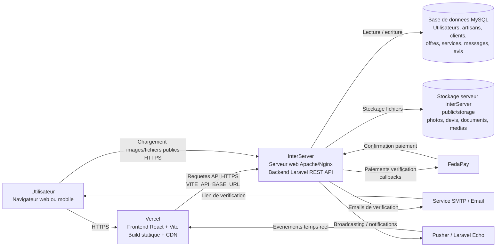
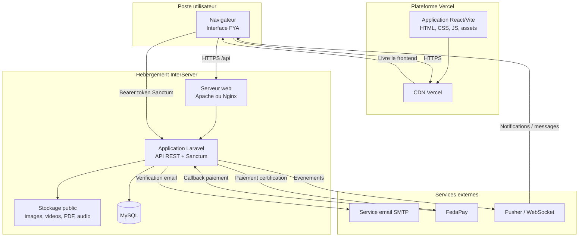
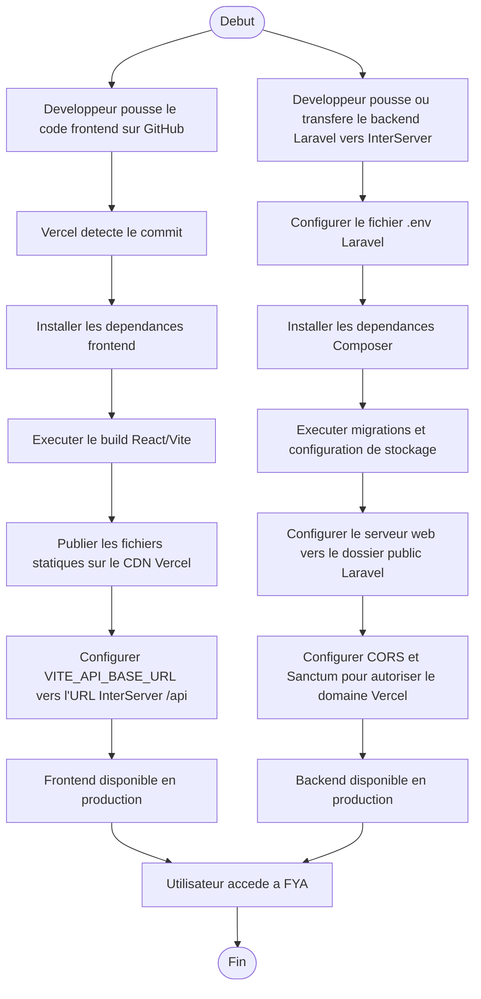

# Diagramme de deploiement - FYA

Ce diagramme presente l'architecture de deploiement de FYA : le frontend React/Vite est deploye sur Vercel, tandis que le backend Laravel est heberge sur InterServer.

## Architecture de deploiement

## Vue UML simplifiee

## Flux de deploiement

