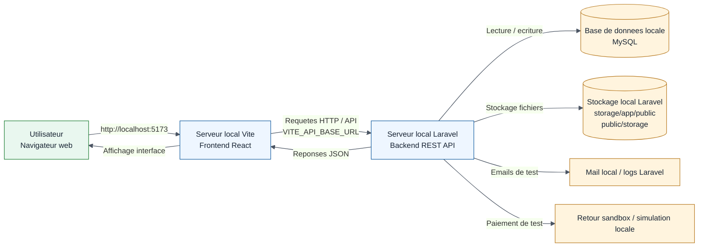
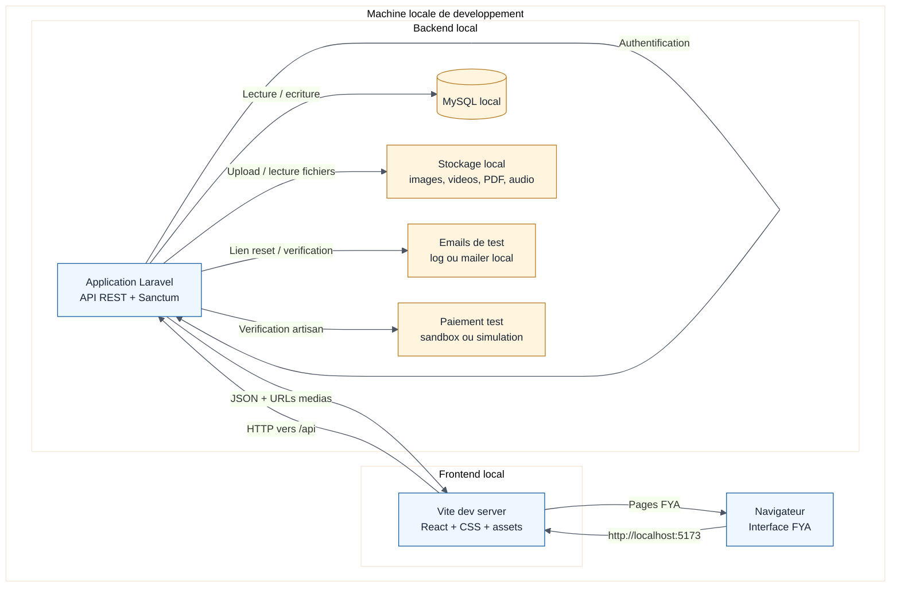
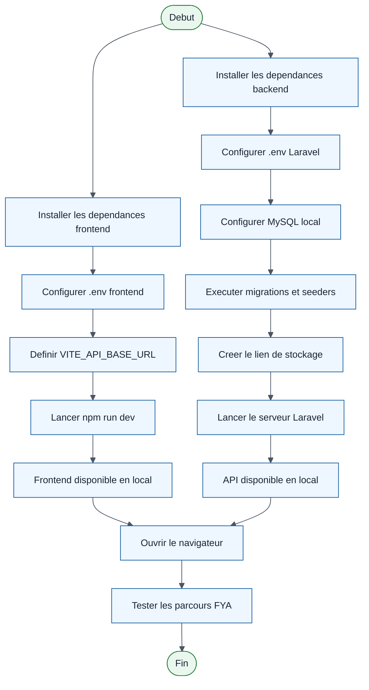

# Diagramme de deploiement local - FYA

Ce diagramme presente l'architecture de deploiement utilisee dans le cadre du projet FYA. La plateforme est executee entierement en local sur une machine de developpement : le frontend React/Vite, le backend Laravel, la base de donnees et le stockage des fichiers fonctionnent sur l'environnement local.

## Architecture de deploiement local

## Vue UML simplifiee

## Flux de lancement local

## Remarque pour le memoire

Dans ce contexte, il ne s'agit pas d'un deploiement en production. Le diagramme montre plutot un deploiement local de developpement, ou tous les composants sont executes sur la meme machine. Les plateformes comme Vercel, InterServer ou un CDN ne sont donc pas representees.
