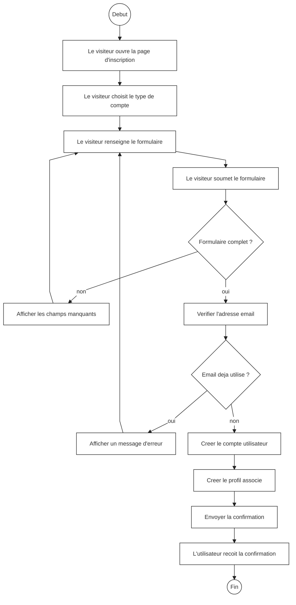
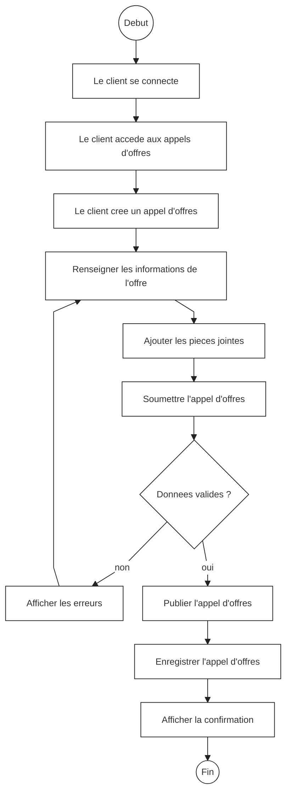
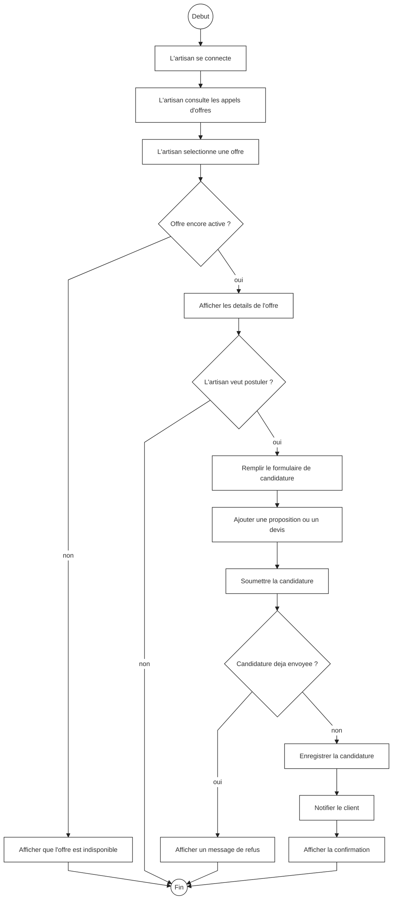
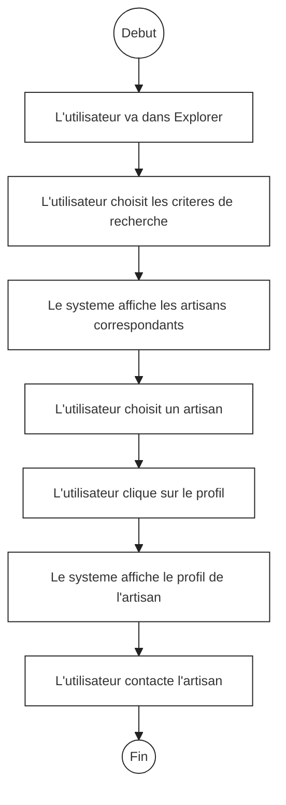
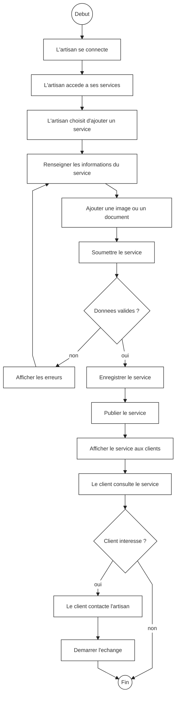
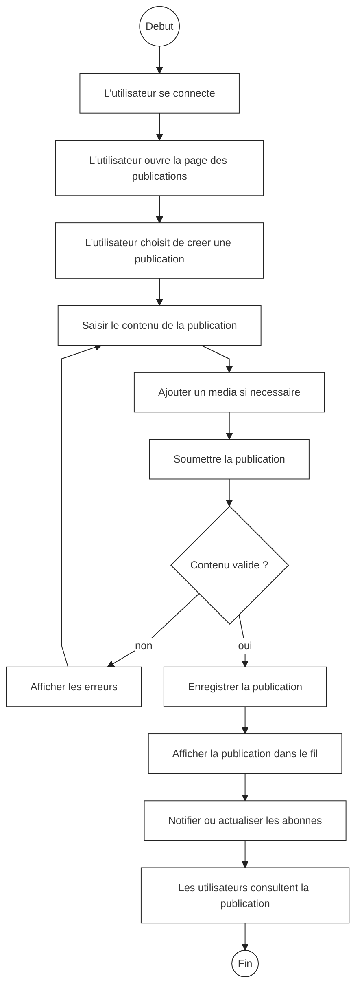
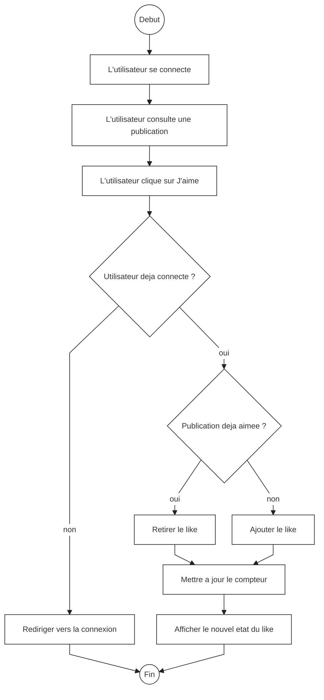
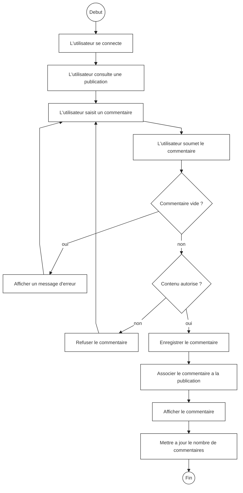

# Diagrammes d'activites demandes

Ce fichier contient uniquement les diagrammes d'activites suivants :

- Inscription
- Appel d'offres
- Candidature a un appel d'offres
- Recherche d'un artisan
- Services
- Publications
- Likes
- Commentaires

Les diagrammes sont au format Mermaid et peuvent etre importes dans Draw.io.

## 1. Inscription

## 2. Appel d'offres

## 3. Candidature a un appel d'offres

## 4. Recherche d'un artisan

## 5. Services

## 6. Publications

## 7. Likes

## 8. Commentaires

