# Diagrammes d'activites - FYA

Ces diagrammes completent les diagrammes de sequence. Ils presentent les flux fonctionnels principaux de la plateforme FYA : visiteurs, clients, artisans et administrateurs.

## 1. Vue d'ensemble du parcours utilisateur

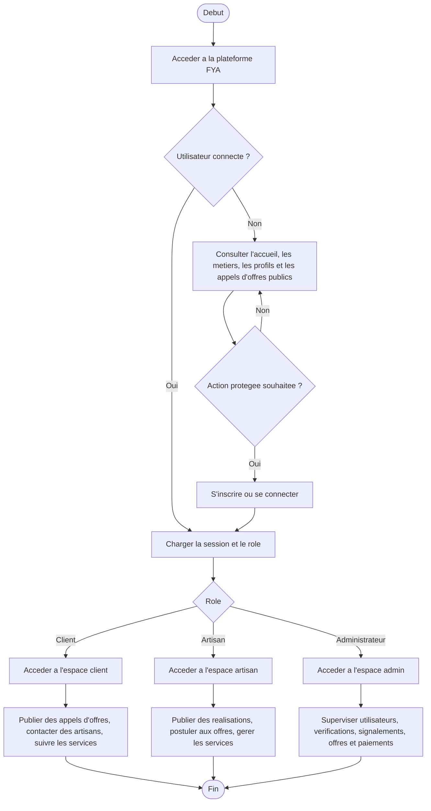

## 2. Inscription et verification email

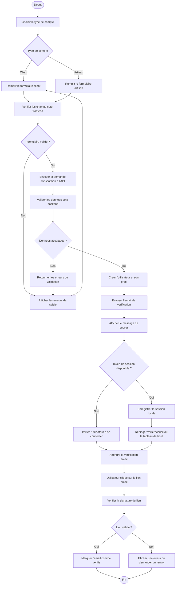

## 3. Connexion et acces selon le role

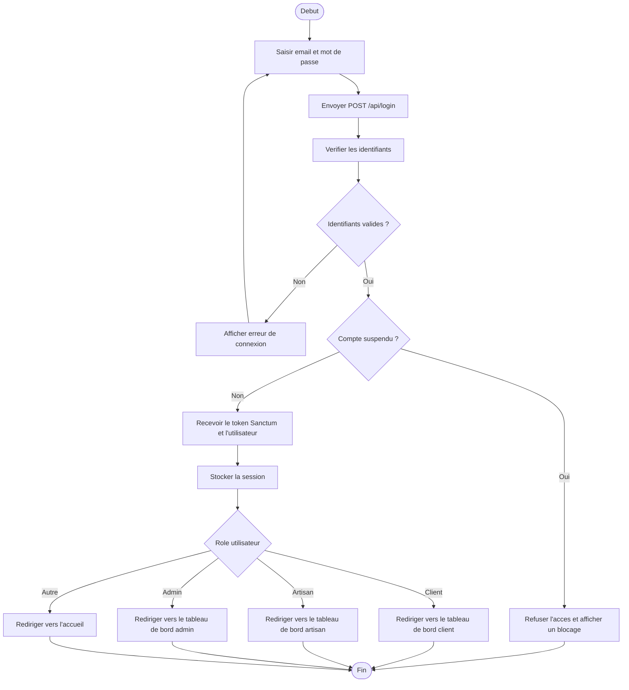

## 4. Recherche d'artisans et consultation d'un profil

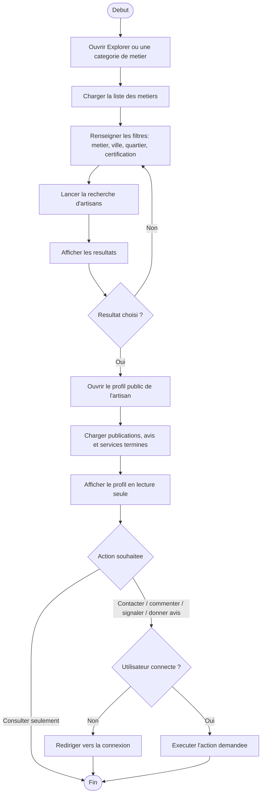

## 5. Publication, like et commentaire

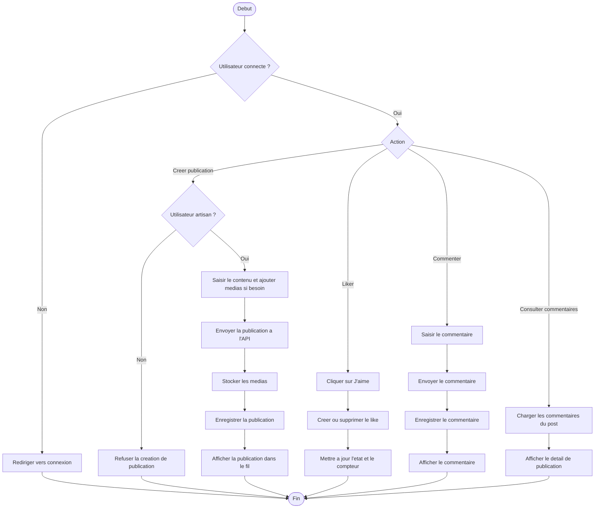

## 6. Appel d'offres et candidature artisan

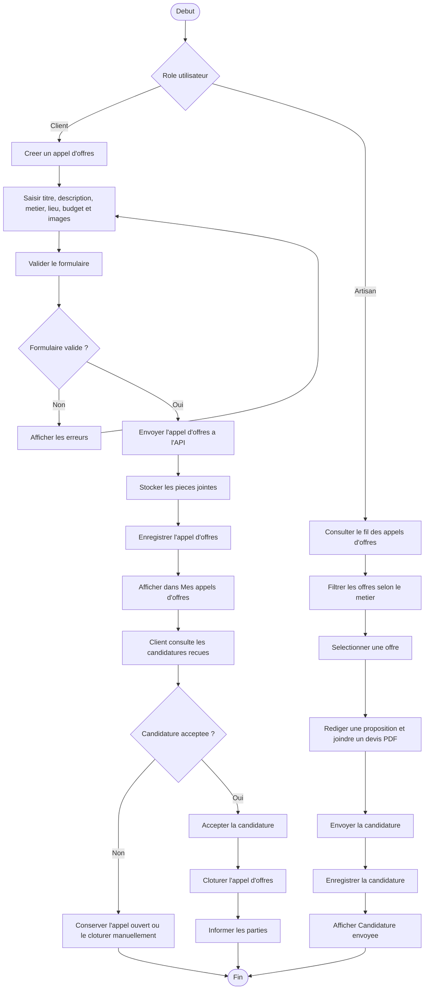

## 7. Messagerie et envoi de messages

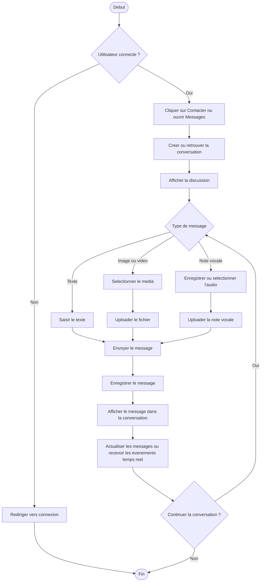

## 8. Creation et suivi d'un service

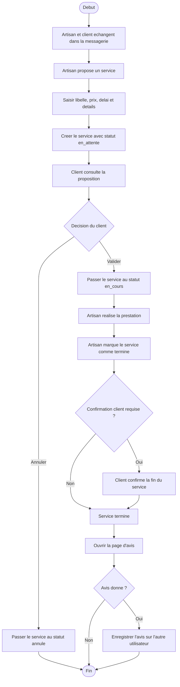

## 9. Verification artisan et validation admin

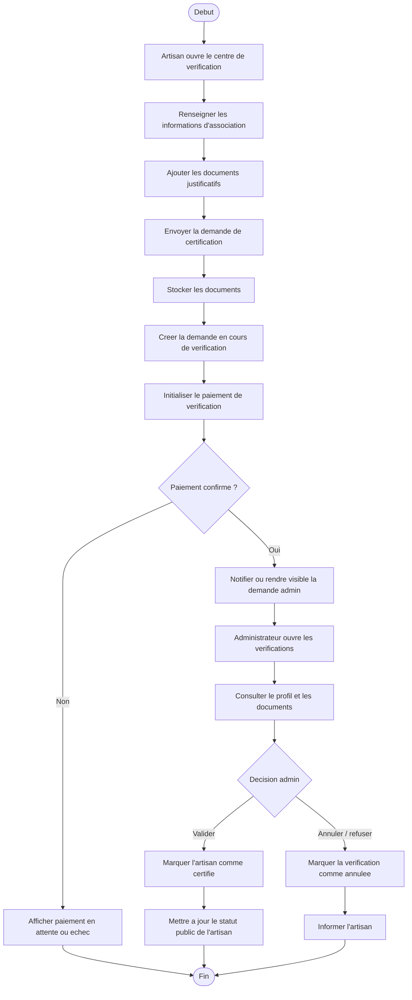

## 10. Signalement et traitement admin

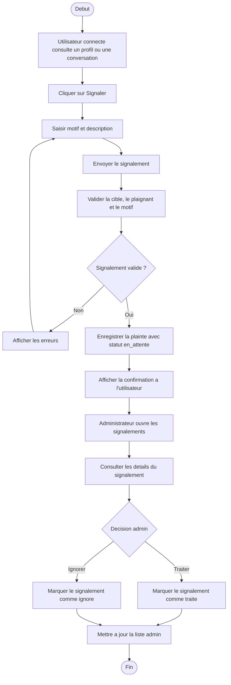

## 11. Administration globale

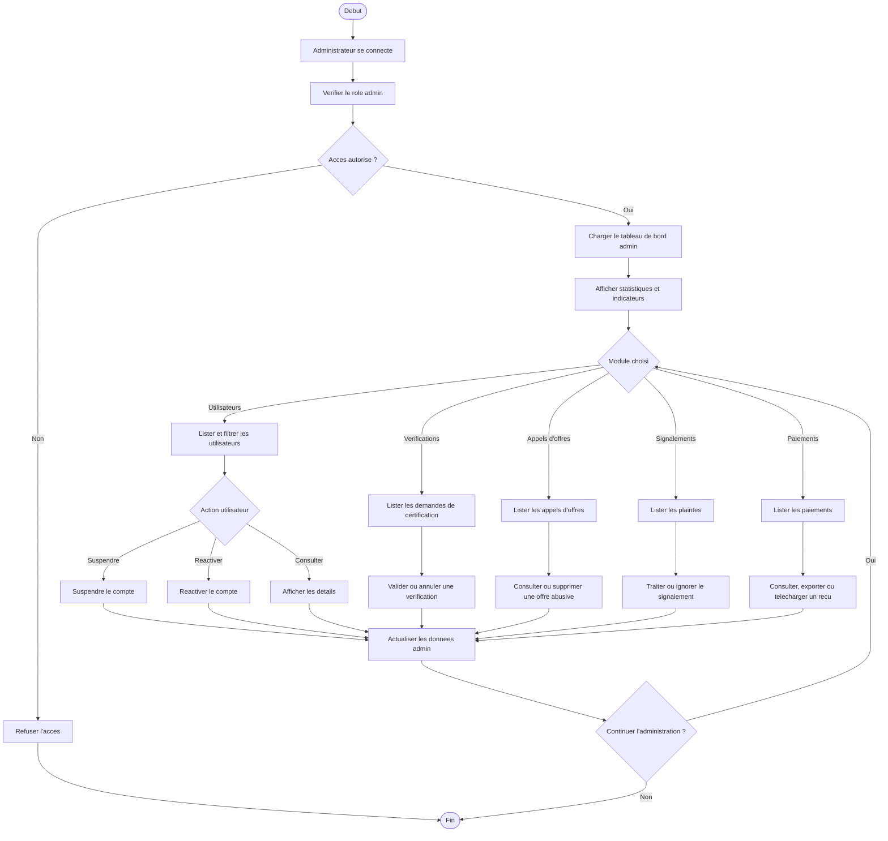

