# Diagrammes d'activites - FYA

Ce fichier contient des diagrammes d'activites prets a etre integres dans un memoire au format A4. Les flux ont ete decoupes en plusieurs diagrammes courts afin d'eviter les figures trop longues, difficiles a lire ou mal adaptees a une page.

## Recommandations d'insertion A4

- Inserer un seul diagramme par figure.
- Exporter chaque diagramme en SVG ou PNG haute resolution.
- Utiliser une orientation portrait pour les diagrammes verticaux.
- Utiliser une orientation paysage seulement si le diagramme parait trop large.
- Garder une taille de texte entre 13 px et 15 px.
- Eviter les libelles trop longs dans les noeuds : preferer des formulations courtes.

Pour agrandir ou reduire les textes, modifier `fontSize` et les `font-size` dans le bloc Mermaid du diagramme concerne.

## Style Mermaid conseille

Chaque diagramme contient sa propre configuration Mermaid afin de pouvoir etre copie, exporte et insere separement dans le memoire.

## 1. Parcours general d'un utilisateur

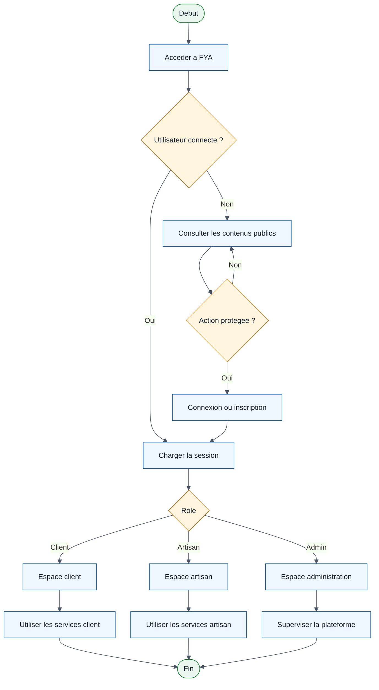

## 2. Inscription d'un client ou d'un artisan

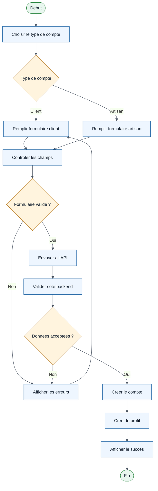

## 3. Connexion et redirection selon le role

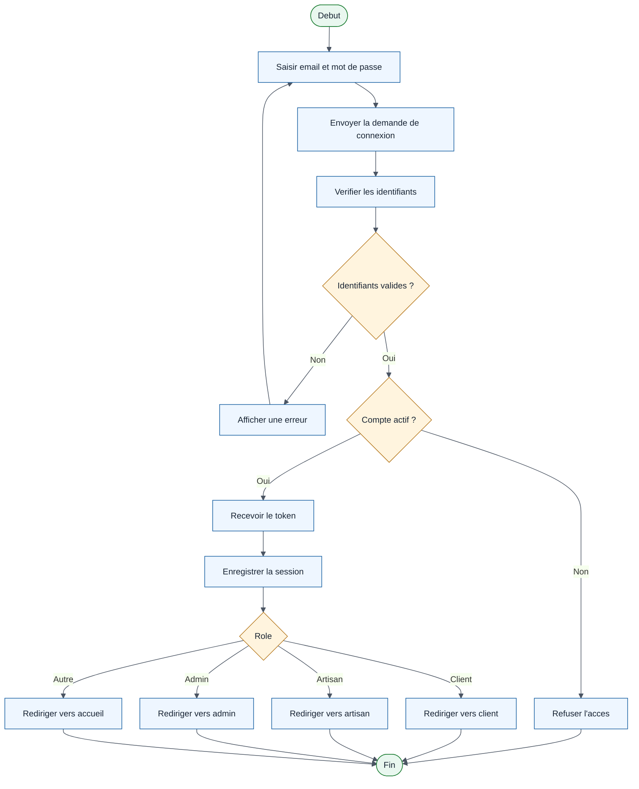

## 4. Recherche et consultation d'un artisan

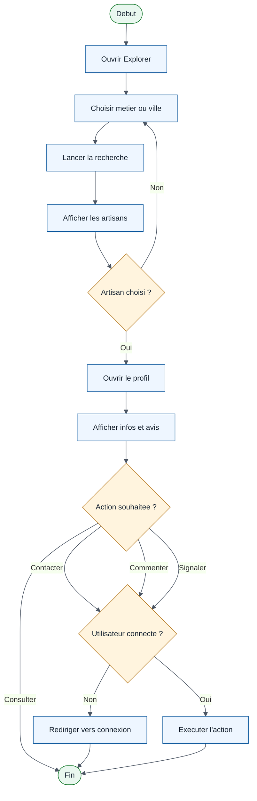

## 5. Publication artisan, reactions et commentaires

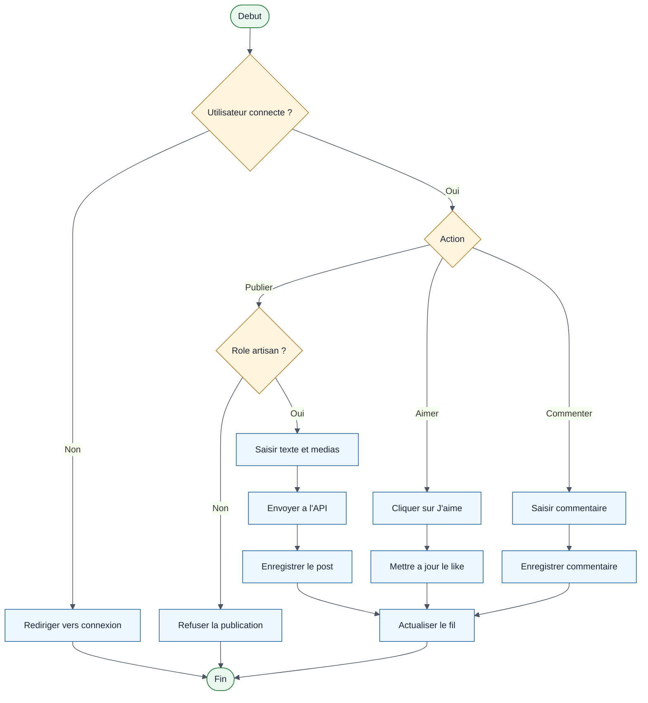

## 6. Appel d'offres et candidature artisan

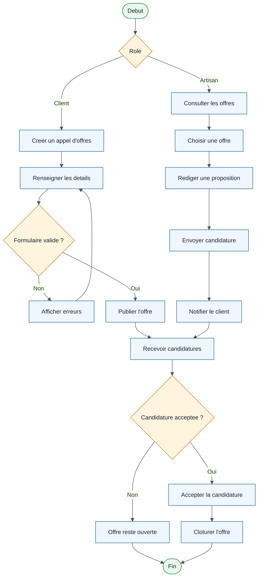

## 7. Messagerie entre client et artisan

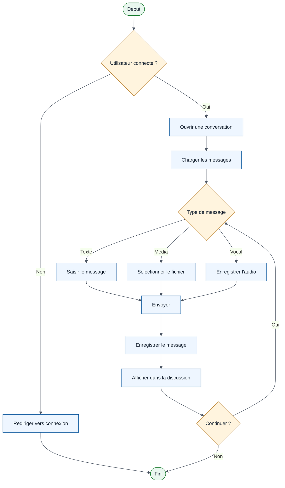

## 8. Creation et suivi d'un service

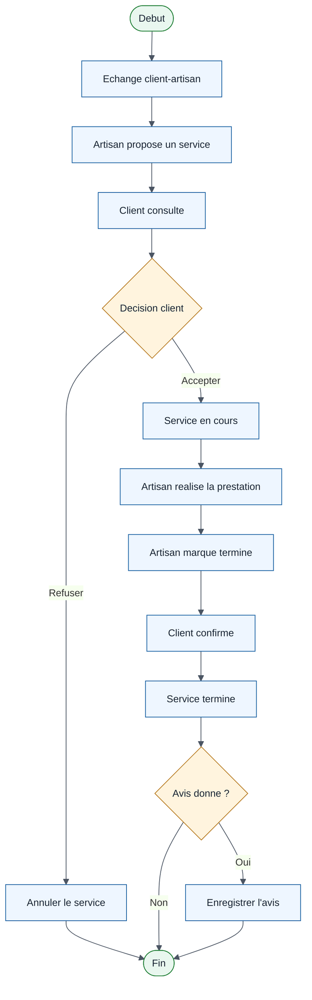

## 9. Verification artisan et paiement sandbox

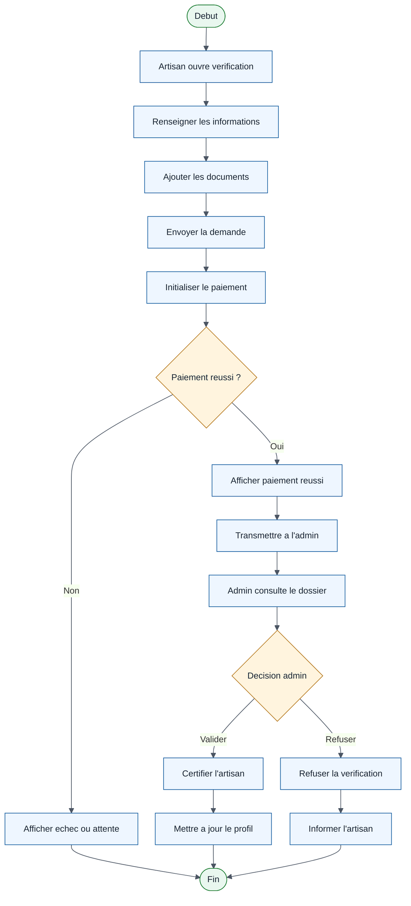

## 10. Mot de passe oublie

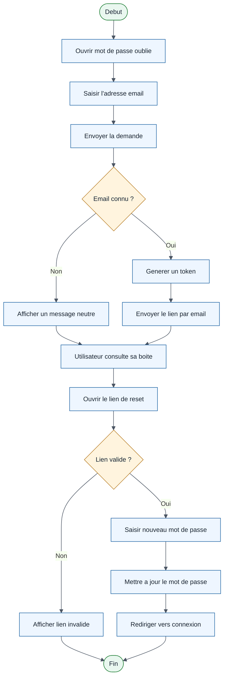

## 11. Signalement et traitement administratif

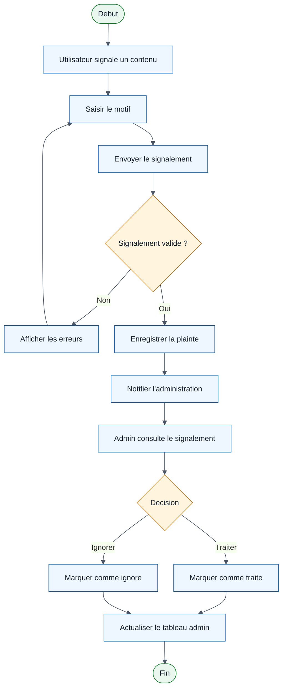

## 12. Administration globale

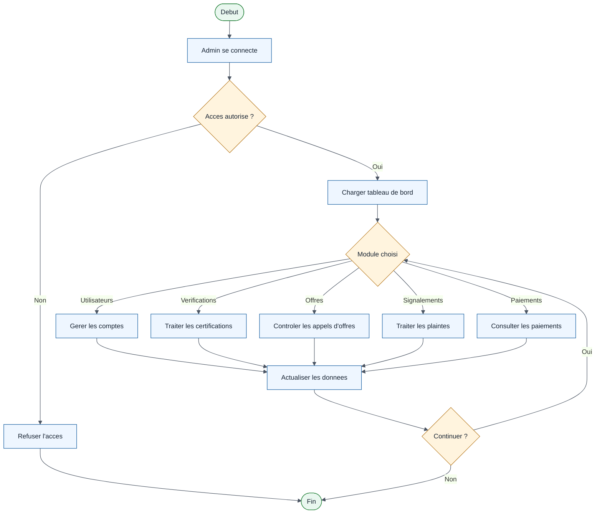
