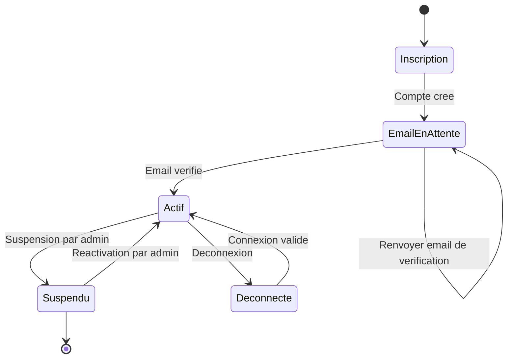
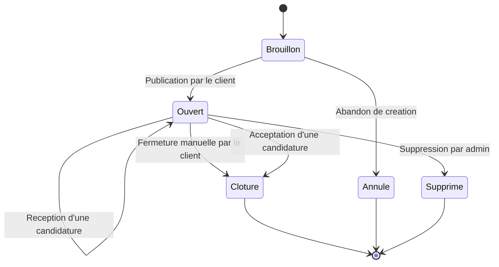
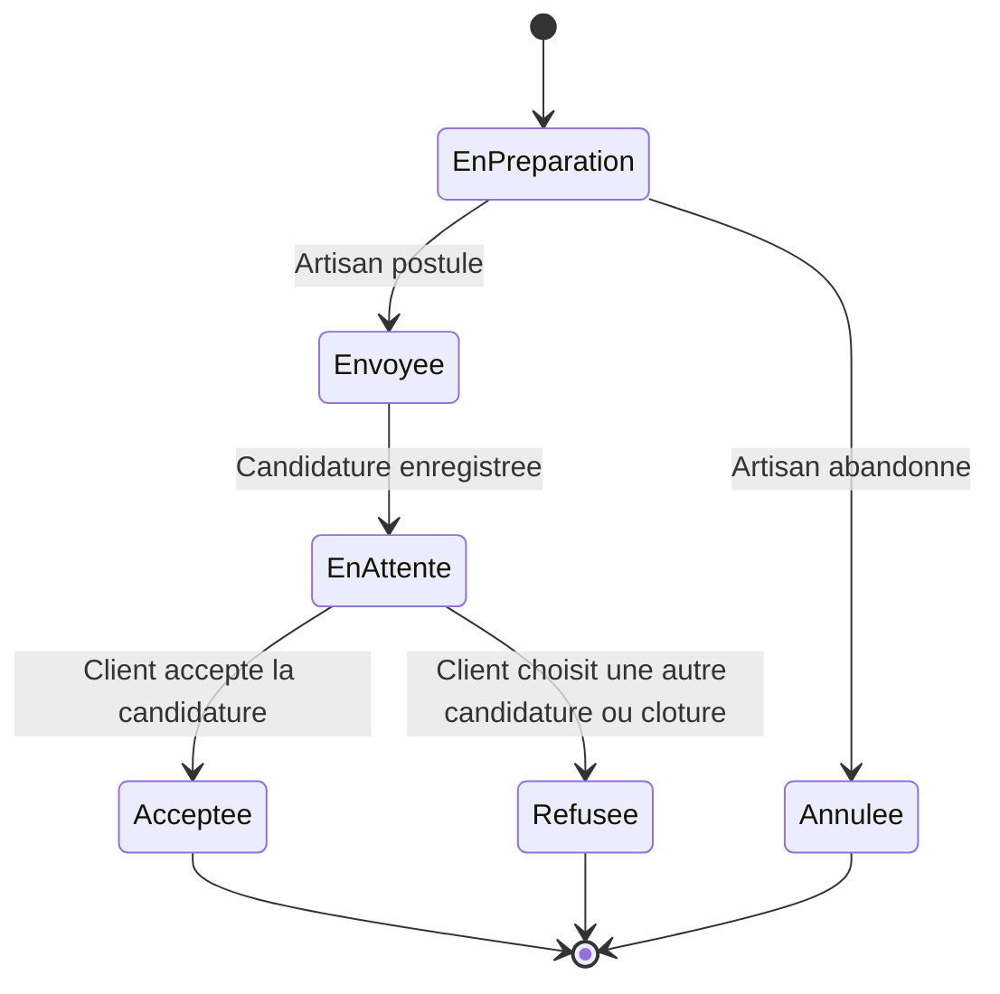
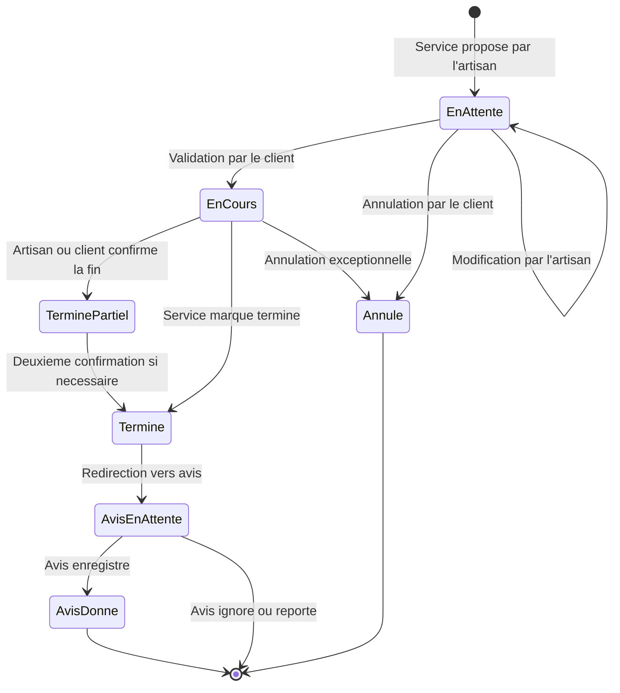
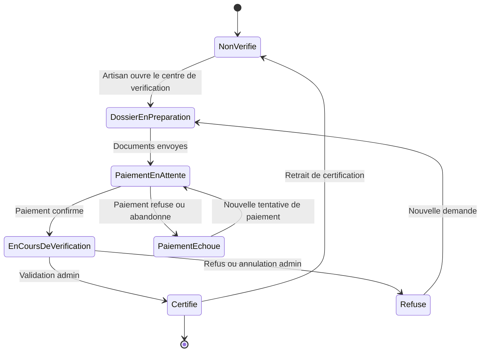
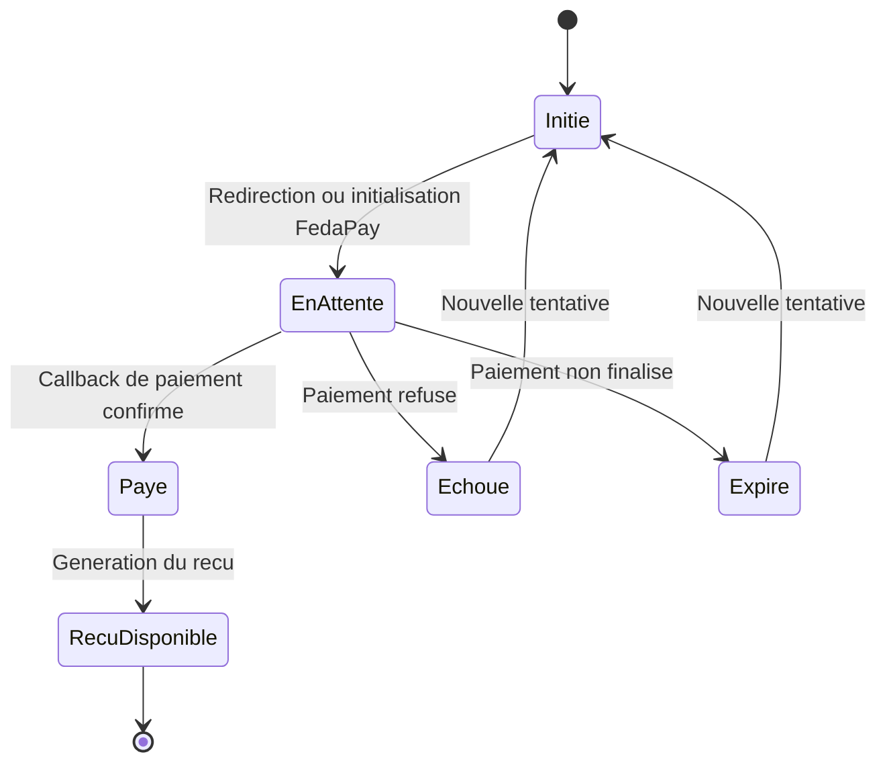
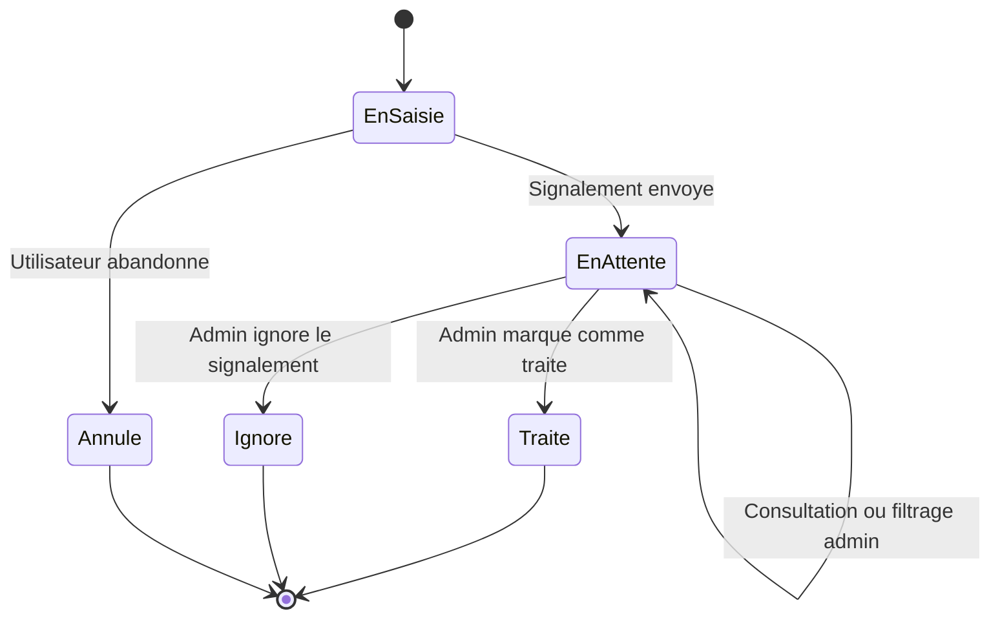
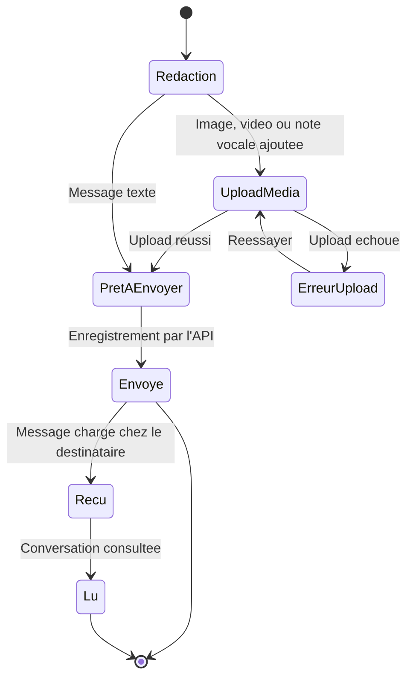
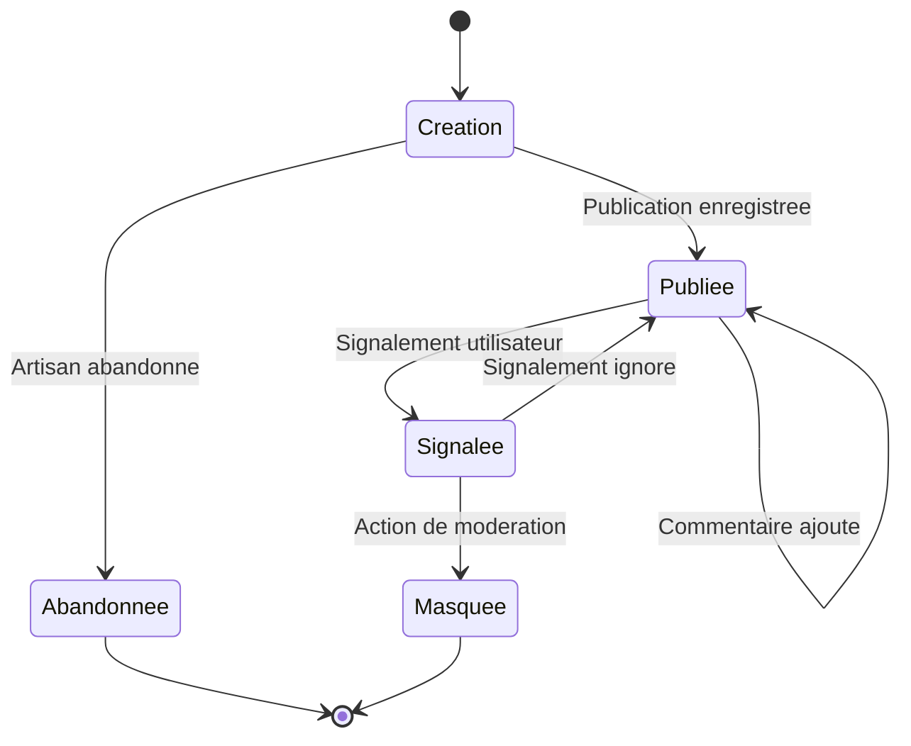

# Diagrammes d'etats-transitions - FYA

Ces diagrammes montrent les changements d'etat des principales entites de la plateforme FYA. Ils completent les diagrammes de sequence, d'activites et de deploiement.

## 1. Etat d'un compte utilisateur

## 2. Etat d'un appel d'offres

## 3. Etat d'une candidature artisan

## 4. Etat d'un service

## 5. Etat d'une verification artisan

## 6. Etat d'un paiement

## 7. Etat d'un signalement

## 8. Etat d'un message

## 9. Etat d'une publication

