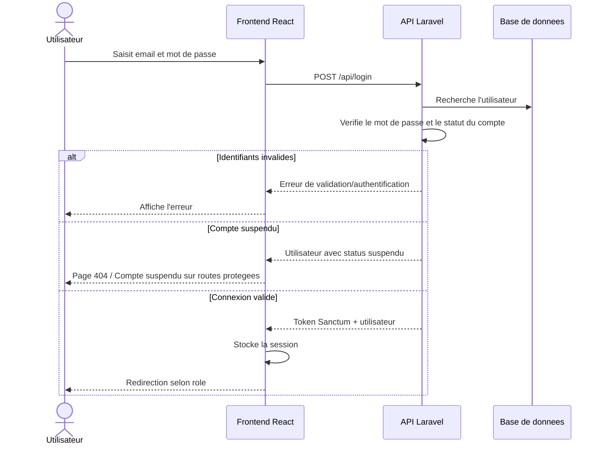
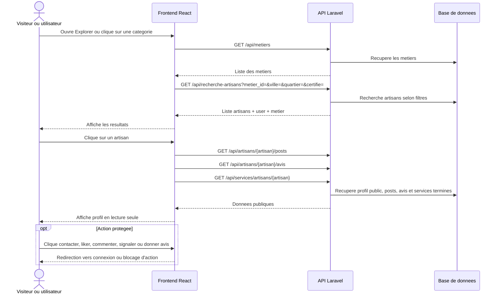
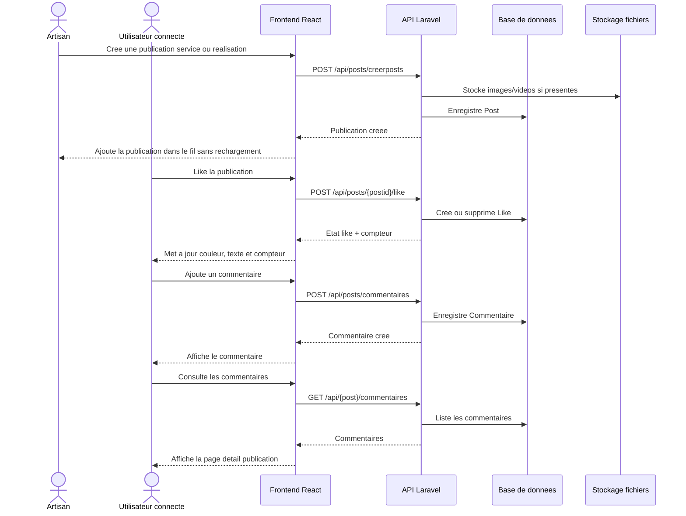
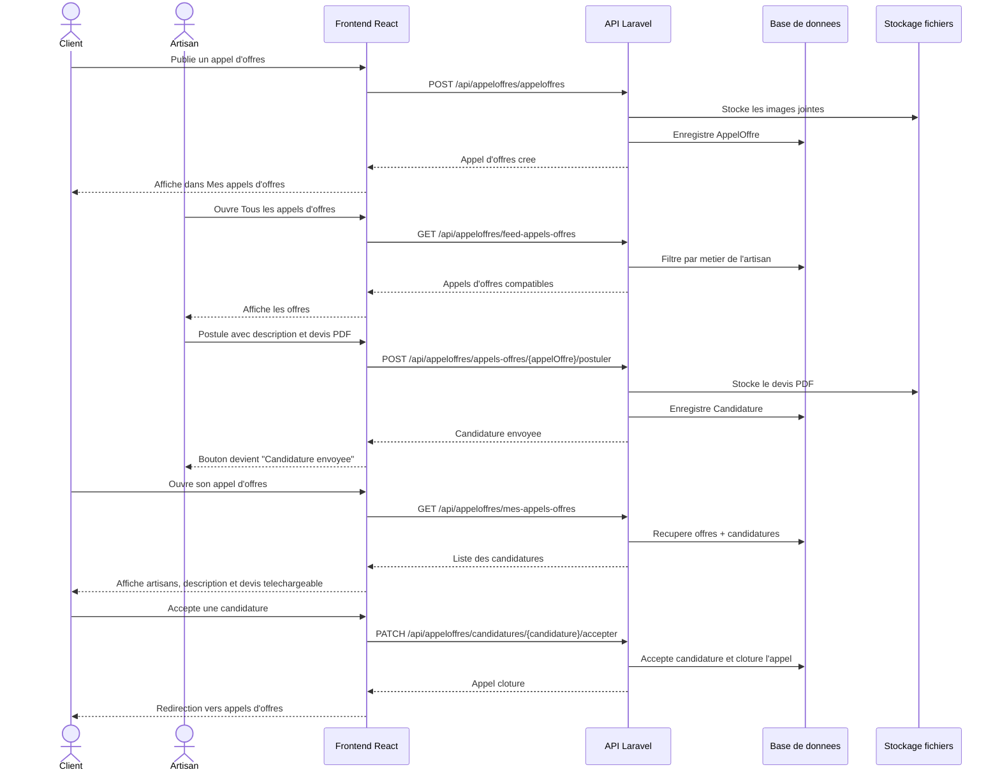
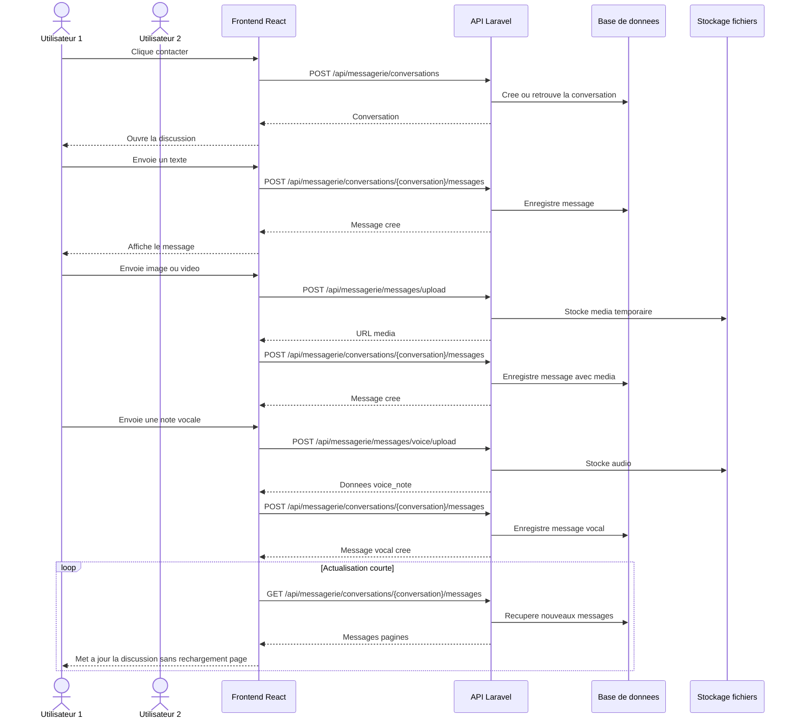
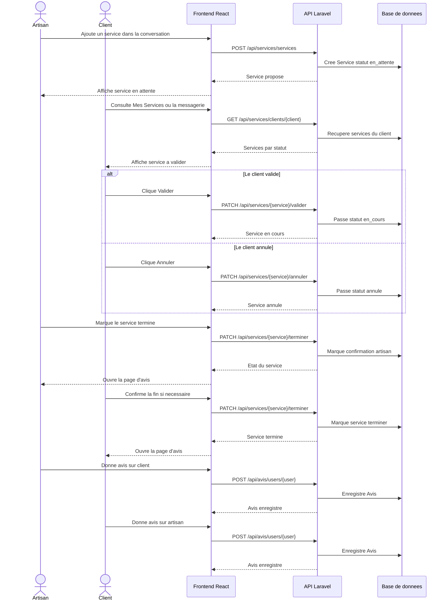
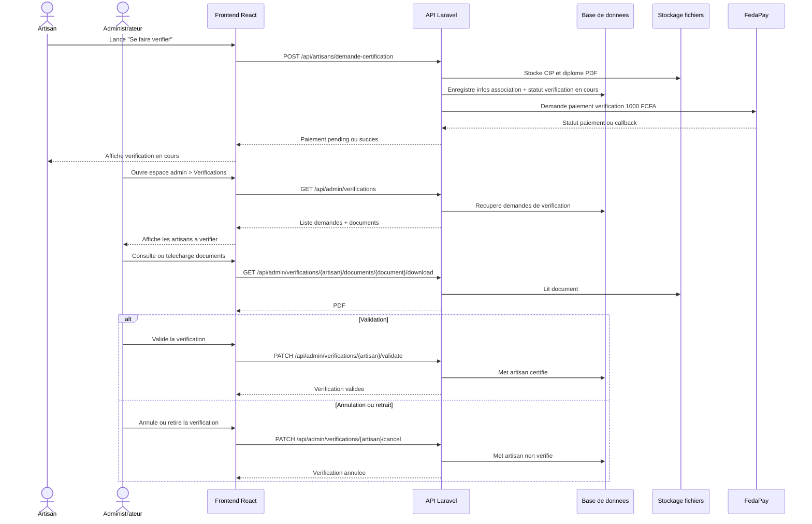
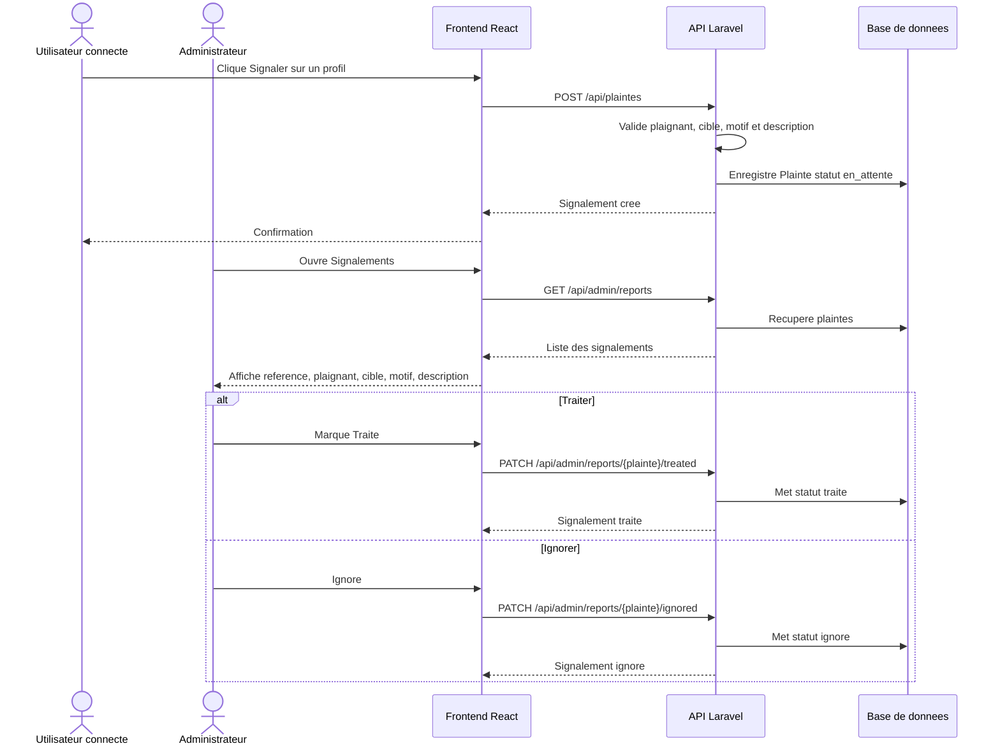
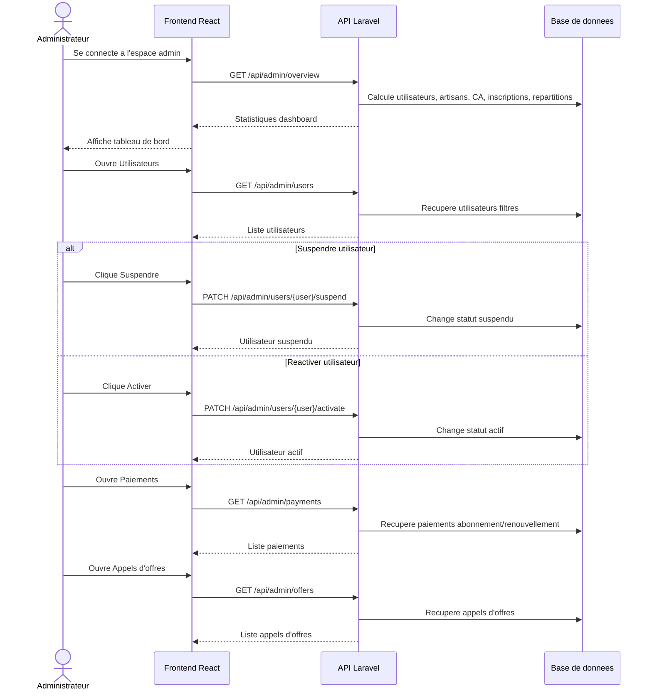

# Diagrammes de sequence - FYA

Ces diagrammes sont prepares pour une soutenance. Ils decrivent les principaux parcours de la plateforme FYA en s'appuyant sur les routes du backend Laravel.

## 1. Inscription et verification email

```mermaid
%%{init: {'themeVariables': { 'fontSize': '20px'}}}%%
flowchart TD
A[Texte en 20px] --> B(Autre texte)
sequenceDiagram
    actor U as Utilisateur
    participant F as Frontend React
    participant API as API Laravel
    participant DB as Base de donnees
    participant Mail as Service email

    U->>F: Remplit le formulaire d'inscription
    F->>F: Verifie les champs et le mot de passe
    F->>API: POST /api/register/client ou /api/register/artisan
    API->>API: Valide email, telephone, mot de passe et role
    API->>DB: Cree User + Client ou Artisan
    API->>Mail: Envoie le lien de verification email
    API-->>F: Retourne succes + utilisateur/token si disponible
    F->>F: Affiche "Inscription reussie, validez l'email"
    U->>F: Clique sur OK
    F->>F: Cree la session locale si token disponible
    F-->>U: Redirection vers l'accueil

    U->>API: GET /api/email/verify/{id}/{hash}
    API->>DB: Marque email_verified_at
    API-->>U: Email verifie
```

## 2. Connexion et acces selon le role



## 3. Recherche d'artisans et consultation publique du profil



## 4. Publication, like et commentaire



## 5. Appel d'offres et candidature artisan



## 6. Messagerie texte, image, video et note vocale



## 7. Creation et suivi d'un service depuis la messagerie



## 8. Verification artisan et validation admin



## 9. Signalement utilisateur et traitement admin



## 10. Administration globale



